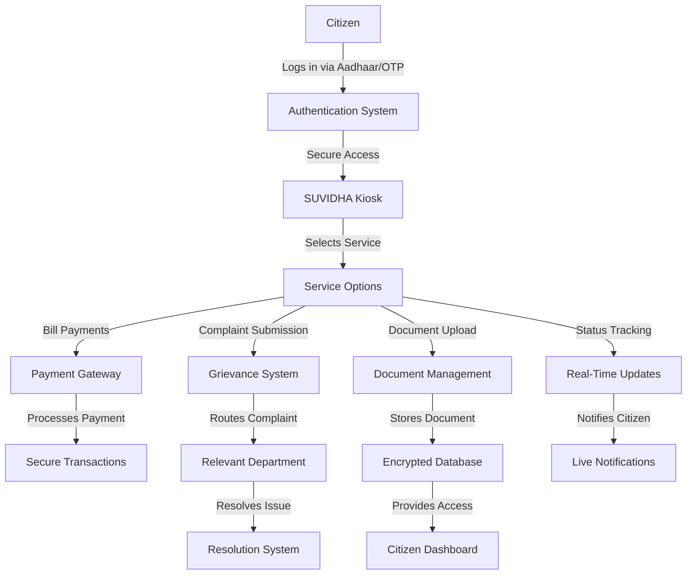

# Smart Urban Virtual Interactive Digital Helpdesk Assistant (SUVIDHA) - 2026

## Problem Statement
Participants are required to design and develop a Smart Urban Digital Helpdesk Assistant (SUVIDHA) — a public-facing, touch-based kiosk interface for customer interaction in civic utility offices. The solution should address real-world challenges of modern urban governance by improving accessibility, transparency, and efficiency in citizen–government interactions.

The objective is to build a single, integrated, self-service digital kiosk capable of delivering essential public utility services across multiple departments, including:

- **Electricity Utility Offices**
- **Gas Distribution Offices**
- **Municipal Corporations (Water Supply, Waste Management)**

The proposed kiosk solution must support a multilingual user interface, secure citizen authentication, service request and complaint submission, document upload functionality, real-time application status tracking, and automated receipt generation. The system should be scalable, reliable, and designed for intuitive use by citizens of diverse backgrounds.

---

## Introduction
The **Centre for Development of Advanced Computing (C-DAC)**, under the Ministry of Electronics and Information Technology (MeitY), is spearheading the development of innovative solutions to modernize civic service delivery in India. As part of the "Smart City 2.0" initiative, C-DAC is working on empowering Indian industries to create indigenous solutions for urban governance challenges.

The SUVIDHA 2026 hackathon invites participants to design next-generation kiosk user interfaces and workflows for real-time citizen interaction in public utility offices. The goal is to streamline service delivery, improve citizen experience, and enhance the efficiency of civic utility offices.

---

## Objectives

1. **Interactive User Interface**:
   - Develop a user-friendly, touch-based interface with step-by-step instructions.
   - Support multilingual functionality and accessibility options for diverse users.

2. **Self-Service Functionality**:
   - Enable citizens to perform routine tasks such as bill payments, service requests, and complaint registration independently.

3. **Real-Time Information**:
   - Provide instant access to account details, consumption data, payment history, and service notifications.

4. **Secure Transactions**:
   - Implement robust authentication mechanisms and encrypted communication to ensure data security.

5. **Reporting and Analytics**:
   - Capture customer interactions and generate actionable insights for optimizing service operations.

---

## Key Features

### Unified Service Interface
- Centralized access to all civic services, including electricity, gas, water, and waste management.

### Real-Time Status & Notifications
- Live updates on service requests, payments, outages, advisories, and emergencies.

### Self-Service Citizen Operations
- Support for bill payments, new connections, meter readings submission, and complaints registration.

### Document Access
- Citizens can download or print receipts, certificates, and service summaries.

### Admin Controls
- Backend access for office staff to monitor kiosk usage, generate reports, and manage content.

---

## Technical Requirements

### Frontend
- **Technology**: React.js or Angular with responsive design frameworks.
- **Why**: Ensures a seamless and intuitive user experience across devices.

### Backend
- **Technology**: Node.js / Python / Go / Java for developing individual services.
- **Why**: Provides flexibility and scalability for handling diverse service requirements.

### Architecture Style
- **Microservices**: Independent, loosely coupled services communicating via REST or gRPC.
- **Why**: Enhances scalability, maintainability, and fault tolerance.

### Security
- **OAuth2 / JWT**: For secure authentication.
- **TLS**: For encrypted service-to-service communication.
- **Why**: Ensures data confidentiality and compliance with regulatory standards.

### Database
- **Technology**: MySQL / PostgreSQL for storing interaction logs and user data.
- **Why**: Reliable and efficient for managing structured data.

### Payment Gateway
- **Integration**: Secure online transaction processing.
- **Why**: Simplifies bill payments and ensures financial security.

---

## Detailed Workflow Diagram
Below is a detailed workflow diagram showcasing how SUVIDHA handles citizen interactions and processes:

---

## How SUVIDHA Handles Processes

### 1. Authentication and Security
- **Process**: Citizens log in using Aadhaar or OTP for secure access.
- **Why It’s Important**: Ensures only authorized users can access sensitive services.
- **Technology Used**: OAuth2, JWT, and encrypted communication protocols.

### 2. Service Selection
- **Process**: Citizens choose from a range of services like bill payments, complaints, document uploads, and status tracking.
- **Why It’s Important**: Provides a unified interface for all civic services, reducing complexity.
- **Technology Used**: React.js for frontend, Node.js for backend.

### 3. Bill Payments
- **Process**: Citizens can pay utility bills securely through an integrated payment gateway.
- **Why It’s Important**: Simplifies financial transactions and reduces the need for physical counters.
- **Technology Used**: Secure payment APIs, TLS encryption.

### 4. Complaint Submission
- **Process**: Citizens submit grievances, which are routed to the relevant department for resolution.
- **Why It’s Important**: Streamlines the grievance redressal process and ensures accountability.
- **Technology Used**: AI-based complaint categorization, REST APIs.

### 5. Document Upload and Management
- **Process**: Citizens upload necessary documents, which are stored securely in an encrypted database.
- **Why It’s Important**: Reduces paperwork and ensures data security.
- **Technology Used**: Cloud storage with encryption, secure upload protocols.

### 6. Real-Time Status Tracking
- **Process**: Citizens track the status of their requests and receive live notifications.
- **Why It’s Important**: Enhances transparency and keeps citizens informed.
- **Technology Used**: WebSockets for real-time updates, notification APIs.

### 7. Admin Dashboard
- **Process**: Administrators monitor kiosk usage, generate reports, and manage services.
- **Why It’s Important**: Provides insights for optimizing service delivery and managing resources.
- **Technology Used**: Analytics dashboards, data visualization tools.

---

## Importance of SUVIDHA

### Addressing Real-World Challenges
- **Accessibility**: Reduces dependency on physical counters and long queues.
- **Transparency**: Provides real-time updates and secure transactions.
- **Efficiency**: Streamlines service delivery, reducing administrative burden.

### Empowering Citizens
- **Inclusivity**: Multilingual support and accessibility options ensure no citizen is left behind.
- **Self-Reliance**: Enables citizens to independently access essential services.

### Supporting Urban Governance
- **Data-Driven Insights**: Helps authorities optimize resource allocation and improve service quality.
- **Scalability**: Designed to adapt to the growing needs of urban cities.

---

## How SUVIDHA Works

### Citizen Interaction
1. **Authentication**: Citizens log in securely using Aadhaar or mobile OTP.
2. **Service Selection**: Choose from a range of services like bill payments, complaints, or document uploads.
3. **Real-Time Updates**: Track the status of requests and receive notifications.
4. **Receipt Generation**: Download or print receipts for completed transactions.

### Admin Dashboard
- Monitor kiosk usage and generate reports.
- Manage content and update service workflows.
- Analyze citizen interaction data for decision-making.

---

## Why SUVIDHA is the Best Solution (Expanded)

1. **Comprehensive Service Integration**:
   - Combines multiple civic services into a single platform.
   - Reduces the need for citizens to visit multiple offices.

2. **Advanced Technology**:
   - Utilizes AI, blockchain, and IoT for efficient service delivery.
   - Implements cutting-edge security measures to protect user data.

3. **User-Centric Design**:
   - Prioritizes inclusivity with multilingual support and accessibility options.
   - Ensures ease of use for citizens of all backgrounds.

4. **Scalability and Reliability**:
   - Designed to handle high user volumes and adapt to future needs.
   - Ensures consistent performance even during peak usage.

5. **Impactful and Transformative**:
   - Enhances citizen satisfaction by reducing wait times and improving transparency.
   - Supports urban governance by providing actionable insights through analytics.

---

## Conclusion
SUVIDHA is a groundbreaking solution that addresses the challenges of modern urban governance. By integrating advanced technologies and focusing on user needs, it sets a new standard for smart city solutions. This platform not only improves service delivery but also empowers citizens, making it a vital step toward building smarter, more inclusive cities.